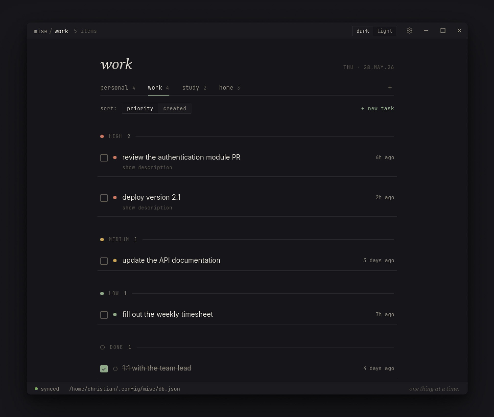
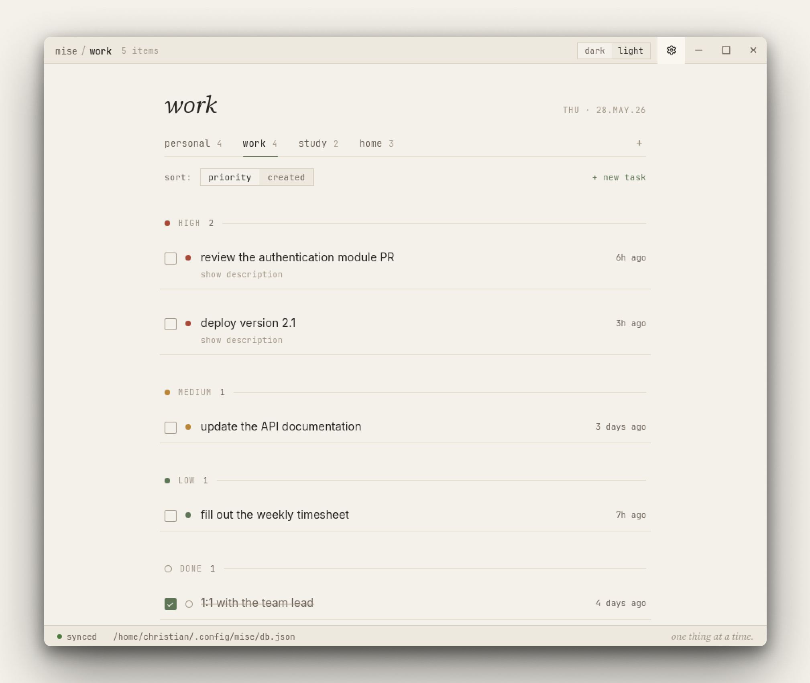
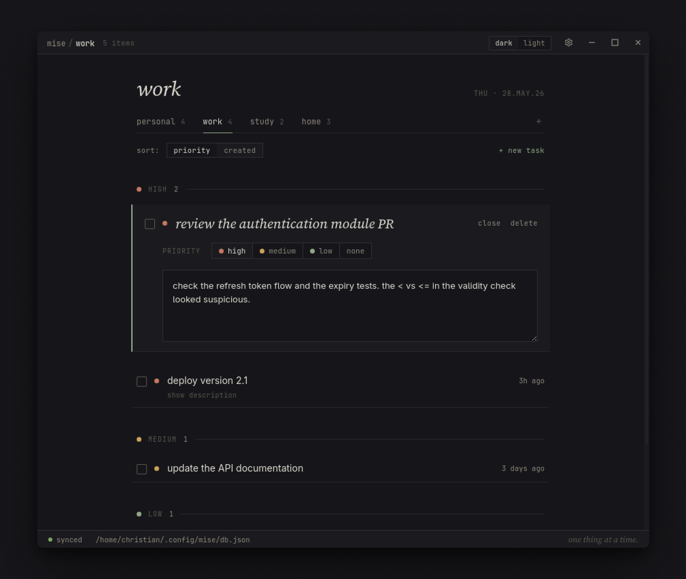
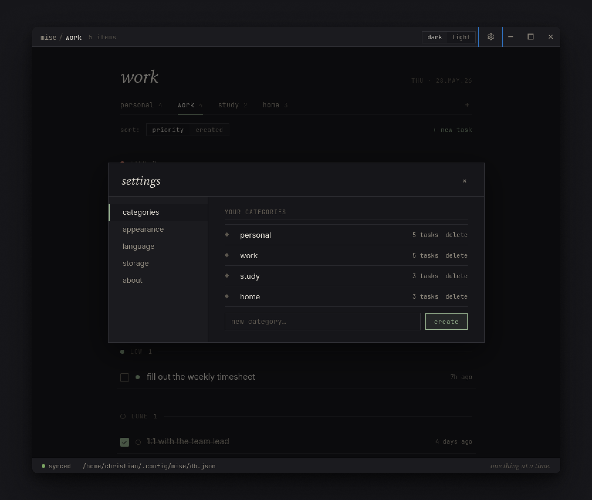
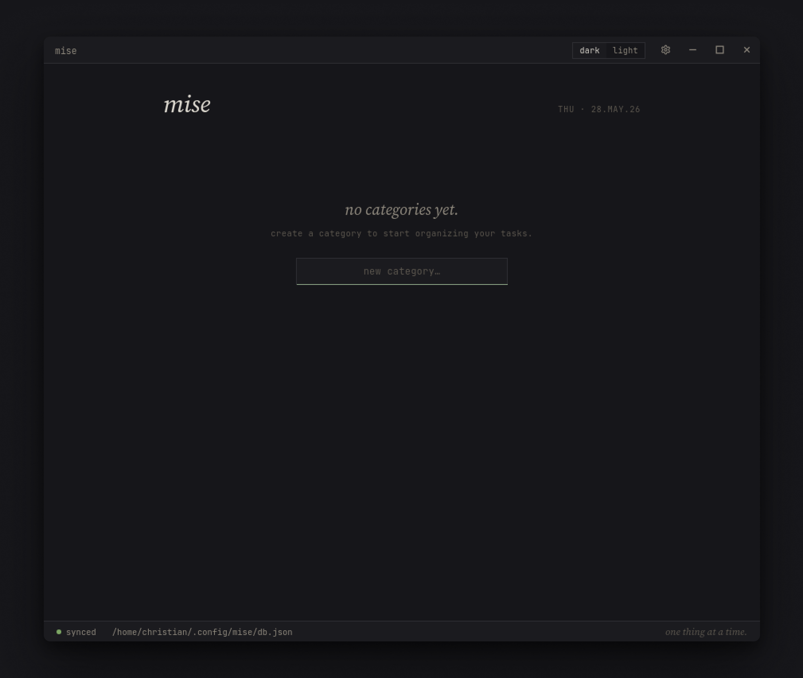

<p align="center">
  
</p>

<h1 align="center">mise</h1>

<p align="center">
  A minimal Linux desktop task manager.
</p>

---

You write down what's on your mind. You do one thing. Then the next. mise does not nag, sync, score your productivity, or ask you to log in. It keeps a single local JSON file and gets out of your way.

No AI. No accounts. No cloud. No streaks. Just categories, tasks, and a priority you set yourself.

> *"uma coisa de cada vez." — one thing at a time.*

Tauri 2 + React. Linen (dark) / linen (light). Sage accent. Local-first. English + Portuguese.



## Status

Personal project, used daily on Fedora. Builds known to work on:

- **Fedora 41–43 / Nobara** — `.rpm` bundle
- **Ubuntu 22.04+** — `.deb` bundle (needs `libwebkit2gtk-4.1`)

macOS / Windows are not tested. Tauri can target them; PRs welcome.

## What's inside

**Your own categories.** Starts empty — you create the ones you want. Per-category task counts in the tabs. Delete the last one and you're back to a blank slate.

**Priority grouping.** Tasks fall under *high* / *medium* / *low* / *no priority*, marked by a single colored rule — no chips, no badges. Sort by priority or by creation order.

**Expand to edit.** Click a task to open it inline: edit the title (wraps, never truncates), set priority, write a description. Click outside to close. **Show description** reveals notes without opening the task.

**Local-first.** Everything lives in one flat JSON file. Nothing leaves your machine.

**English + Portuguese (BR).** Toggle in Settings → Language. Default follows your system locale. Dates and relative times ("2h ago" / "há 2h") localize too.

**Custom titlebar.** Native window chrome removed; the app draws its own. Drag, minimize, maximize, close — all in-app.

**Settings is a single modal.** Five sections — categories, appearance, language, storage, about — italic-serif titles, hairline-bordered segmented controls. Nothing that looks like a SaaS dashboard.

<table>
  <tr>
    <td></td>
    <td></td>
  </tr>
  <tr>
    <td align="center"><em>Linen — the default</em></td>
    <td align="center"><em>Linen light — same restraint, warm</em></td>
  </tr>
</table>





## Install

Grab the matching artefact from the [latest release](https://github.com/christiansmmc/mise/releases/latest), or build it yourself (below).

### Fedora / RHEL / Nobara

```bash
sudo dnf install ./mise-<version>-1.x86_64.rpm
```

### Ubuntu / Debian

```bash
sudo apt install ./mise_<version>_amd64.deb
```

After install, launch from your desktop menu (the app appears as **mise**).

## First run



mise starts empty. Create your first category, then start adding tasks under it. That's the whole onboarding.

## Building from source

Requires Rust (latest stable), Node ≥ 20, and the Tauri 2 system deps. The frontend uses Vite; there is no separate JS framework toolchain to learn.

### Fedora

```bash
sudo dnf install webkit2gtk4.1-devel librsvg2-devel \
  libayatana-appindicator-gtk3-devel openssl-devel gtk3-devel rpm-build
```

### Ubuntu

```bash
sudo apt install libwebkit2gtk-4.1-dev libssl-dev \
  libayatana-appindicator3-dev librsvg2-dev
```

### Build

```bash
npm install
cargo tauri dev                          # dev mode with hot reload (Vite)
npm run build                            # frontend production build
cargo tauri build --bundles rpm          # Fedora rpm
cargo tauri build --bundles deb          # Ubuntu deb
```

Webkit + Wayland on Fedora needs `WEBKIT_DISABLE_DMABUF_RENDERER=1`; `main.rs` already sets this before webkit init, so the installed app works regardless of how it's launched.

## Config location

mise uses the standard XDG config dir:

- `~/.config/mise/db.json` — a single flat JSON: categories + tasks. Easy to back up, version, or copy.

In the browser (dev without Tauri) it falls back to `localStorage`.

Example:

```json
{
  "categories": [
    { "id": "pessoal", "label": "pessoal" }
  ],
  "tasks": [
    {
      "id": "01HXYZ...",
      "title": "renovar passaporte",
      "prio": "alta",
      "done": false,
      "notes": "agendar atendimento na PF.",
      "category": "pessoal",
      "created": "2026-05-28T14:12:09.221Z"
    }
  ]
}
```

## Project layout

```
index.html            Vite entry
src/                  React frontend
  App.jsx               whole UI (titlebar, list, task rows, settings, i18n)
  main.jsx              mount
  styles.css            galley-style tokens + components

src-tauri/            Rust backend (Tauri 2)
  src/main.rs           commands + webkit env fix
  src/db.rs             load/save the JSON db
  tauri.conf.json       window, bundle, frontendDist
  capabilities/         window permissions (minimize/maximize/close/drag)
  icons/                app icon (all formats)
```

## License

MIT.
